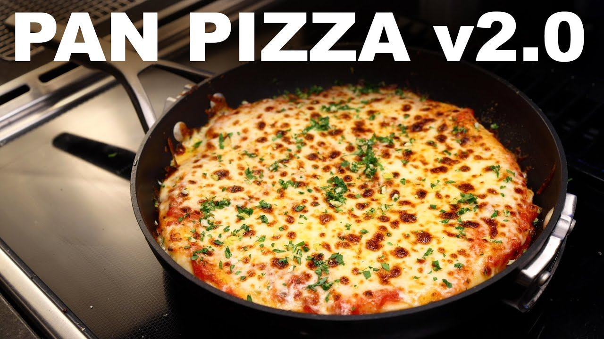

# Pan Pizza
Source: [Adam Ragusea](https://youtu.be/9TjUWnAK0cg)

## Zutaten
**REZEPT, ERGIBT EINE 25-CM-PIZZA**

### Teig
- `1 Tasse (120g)` **Brotmehl** & Extra Mehl zum kneten
- `1/2 Teelöffel (3g)` **Salz**
- `1/2 Teelöffel (2-3g)` **Zucker**
- `1/2 Teelöffel (1-2g)` **Getrocknete Hefe**
- `1/4 Teelöffel (1g)` **Knoblauchpulver** (optional)
- `2 Teelöffel (10mL)` **Olivenöl**
- `1/2 Tasse (120mL)` **Milch** oder **Wasser**

### Soße
- `1/3 cup (80mL)` **Tomatensoße**
- `1 Teelöffel (5g)` **Tomatenmark**
- Eine Prise **Zucker**
- Je eine Priese einiger **Pizza Gewürze** (Oregano, Basilikum, Majoran, Chiliflocken, usw.)

## Belag
- `140-170g` feuchtigkeitsarmer **Mozzarella** (idealerweise nicht vorgerieben)
- geriebener **Parmesan**
- zusätzliches **Olivenöl** und **Pizzakräuter**

## Zubereitung
Alle Zutaten für den Teig vermischen. Wenn er zu feucht zum Kneten ist, fügen Sie mehr Mehl hinzu, aber versuchen Sie, den Teig so klebrig wie möglich zu halten. Kneten, bis er glatt und elastisch ist. Abdecken und 1-2 Stunden gehen lassen, bis sich die Größe verdoppelt hat. (Sie können ihn auch einfach in den Kühlschrank stellen und ihn 1-7 Tage lang langsam gehen lassen).

Nehmen Sie eine 25 cm (10 Zoll) große, antihaftbeschichtete Pfanne (Sie können stattdessen auch ein gut beschichtetes Gusseisen verwenden) und geben Sie gerade so viel Olivenöl hinein, dass der Boden bedeckt ist. Geben Sie einige Ihrer Pizzakräuter und eine winzige Prise Salz hinein, und bedecken Sie die Pfanne mit Öl und Gewürzen. Geben Sie die aufgegangene Teigkugel in die Pfanne und drücken Sie sie mit den Fingerspitzen in die Pfanne, wobei Sie darauf achten müssen, dass sie sie etwas breiter als gewünscht drücken (sie wird sich etwas zusammenziehen). Reiben Sie die Oberfläche mit etwas Olivenöl ein und lassen Sie den Teig noch einmal mindestens 30 Minuten in der Pfanne aufgehen.

Alle Zutaten für die Soße vermengen und den Käse reiben. Einen Backofenrost in die Nähe des Grills stellen.

Wenn Sie zum Backen bereit sind, schalten Sie einen Brenner auf mittlere Hitze unter dem Teig ein, und heizen Sie den Grill im Backofen auf höchste Stufe. Backen Sie den Teig auf dem Herd, bis die Unterseite nach Ihrem Geschmack gebräunt ist, und überprüfen Sie dies regelmäßig, indem Sie den Teig mit einem weichen Spatel anheben. Sie können die Pfanne schütteln, um sicherzustellen, dass der Teig nicht festklebt. Ich mag es, wenn der Boden gerade anfängt zu brennen - das dauert bei mir normalerweise 6-7 Minuten.

Wenn der Boden gar ist, die Pfanne vom Herd nehmen. Die Sauce von Rand zu Rand auftragen. Die Sauce mit Parmesan bestreuen und den Mozzarella von Rand zu Rand auflegen. Nach Belieben weitere Beläge auflegen.

Stellen Sie die Pfanne unter den heißen Grill, schließen Sie die Backofentür und backen Sie, bis der Käse nach Ihrem Geschmack gebräunt ist. Das dauert normalerweise nur zwei Minuten, was meiner Erfahrung nach nicht ausreicht, um die Teflonpfanne zu überhitzen und gefährliche Dämpfe freizusetzen. Wenn Sie in dieser Hinsicht besonders vorsichtig sein müssen (für Haustiere und Menschen mit Atemwegserkrankungen besteht ein hohes Risiko), sollten Sie für dieses Rezept stattdessen eine gusseiserne Pfanne verwenden.

Die Pizza aus dem Ofen nehmen und abkühlen lassen, bis sie gerade so fest ist, dass man sie unversehrt herausnehmen kann - nicht mehr als 5 Minuten. (Je früher man sie aus der Pfanne nimmt, desto knuspriger wird der Boden.) Die Pizza auf ein Abkühlgitter schieben und auf Essenstemperatur abkühlen lassen. Wenn der Boden zu weich oder aufgeweicht ist, können Sie sie wieder in die Pfanne geben und bei mittlerer Hitze eine Minute lang braten, bis sie brutzelt.

In Scheiben schneiden und essen (duh).
