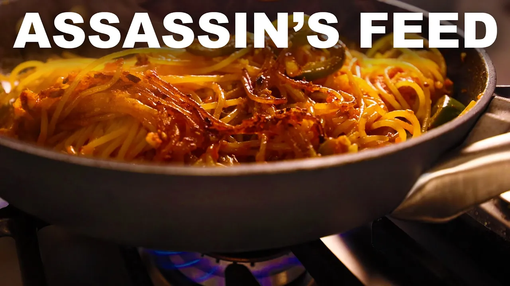

# Spaghetti all'assassina
Quelle: [Adam Ragusea](https://youtu.be/X8B5ZtKIlWY)

## Zutaten
- `283g` frische Trauben- oder Kirschtomaten
- `227g` trockene Spaghetti (idealerweise NICHT in bronzefarben)
- `2` Jalapeños (oder andere große, milde Chilis)
- `5-6` Knoblauchzehen
- Weißwein (wahlweise)
- Tomatenmark
- Olivenöl
- frisches Basilikum zum Garnieren
- Salz

### Eingelegte Chilis zum Garnieren (optional)
- Ein paar Serrano-Chilis (oder andere kleine, milde Chilis)
- Zucker
- Salz
- Essig

## Preparation
Wenn Sie die eingelegten Chilis zubereiten, geben Sie eine große Prise Zucker und eine kleine Prise Salz in eine kleine Schüssel und lösen Sie sie in so viel Essig auf, dass die Chilis bedeckt sind. Halten Sie die Chilis mit einer hitzebeständigen Zange fest und lassen Sie sie im Feuer blanchieren, bis sie fast schwarz werden, und legen Sie sie dann sofort in den Essig. Lassen Sie sie stehen, während Sie alles andere kochen, oder legen Sie sie in den Kühlschrank, wo sie sich mindestens eine Woche halten.

Für die Pasta schneiden Sie die Jalapeños in dicke Scheiben. Wenn Sie die Schärfe verringern möchten, entfernen Sie das weiße Mark und die Kerne aus einigen oder allen Schoten und werfen sie weg. Den Knoblauch schälen und grob hacken.

Die Tomaten pürieren und mit einer etwa gleich großen Menge Wasser verdünnen. Mit einer großen Prise Salz würzen - es soll so salzig wie Suppe schmecken.

Einen dicken Film Olivenöl in einer antihaftbeschichteten oder gut beschichteten gusseisernen Pfanne erhitzen (ich finde, dass die Teflonpfanne viel bessere Ergebnisse liefert), die Paprika und den Knoblauch hineingeben und eine Minute lang braten. Einen kräftigen Spritzer Tomatenmark unterrühren. Etwa 1/4 der Tomatenbrühe angießen (wenn das Öl sehr heiß ist, kann es spritzen, also vorsichtig sein).

Die trockenen Spaghetti hineingeben (wenn nötig, halbieren, damit sie in den Topf passen).  Die Spaghetti ein wenig hin- und herschieben, damit sie sich in der Flüssigkeit einnisten. So lange kochen, bis das meiste Wasser verdampft oder aufgesaugt ist und die untere Schicht der Nudeln brät und bräunt. Ein weiteres Viertel der Tomatenbrühe einrühren und den ganzen Verdampfungs-/Bräunungsprozess wiederholen, bis die gesamte Tomatenbrühe eingefüllt wurde und/oder die Nudeln al dente sind. 

Wenn die Brühe zu Ende geht, einfach mit Wasser oder einem Schuss Weißwein auffüllen. Vielleicht möchten Sie die Nudeln gegen Ende des Prozesses noch einmal abschmecken und eventuell etwas Salz hinzufügen. Unmittelbar vor dem Anrichten einige Basilikumblätter unterrühren. Mit den eingelegten Chilis garnieren, wenn Sie das mögen.
